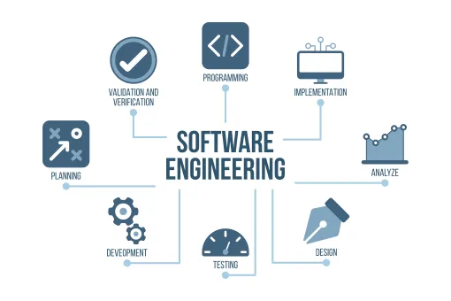
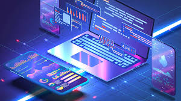

## Innovation, Literally at One's Fingertips

Through software engineering, innovation is quite literally at one’s fingertips. Many ideas that once seemed impossible or unimaginable have been made a reality.

For instance, the ability to register for courses at a university through a website, rather than in person or by mail, has made the process faster and more efficient. Similarly, buying plane tickets and choosing seats online instead of at a counter has revolutionized the travel experience.

Perhaps most notably, social media apps allow us to connect with millions of people across the world in an instant—something that would have seemed unthinkable just a few decades ago. These are just a few examples of how software applications have dramatically increased convenience and efficiency in our daily lives.

*As Anna Eshoo once said, "Innovation is the calling card of the future."*

## Interests in Software Engineering

Software applications transform ideas into real-world solutions, and software engineering is about crafting solutions that are efficient and user-friendly.

Software engineering also has creative potential. It’s not just about solving problems but also about creating something that can express ideas or entertain.

The ability to build applications that can make a tangible difference in people’s lives motivates me to continue developing my skills in this field. I am interested in learning about building and deploying web applications and optimizing code for performance.

## Skills and Experiences I Hope to Develop

I hope to gain experience in and develop various technical skills, such as learning new programming languages that will expand my horizons, learning how to develop websites, and gaining proficiency in both front-end and back-end development, including creating user-friendly interfaces.

I also want to gain experience working in a team to design and implement software, and to develop essential teamwork, collaboration, and communication skills, which are critical for success in real-world work environments.

I aim to develop a well-rounded skill set that combines both technical knowledge and interpersonal effectiveness.
