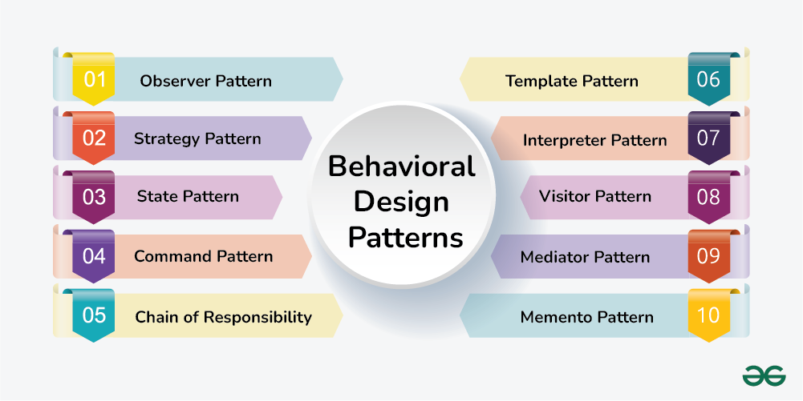

In the world of software development, creating an application feels much like assembling a building. The blueprint is essential, offering a clear structure for the final product, yet it can be flexible enough to accommodate changes and new requirements as construction progresses. But what happens when you're not just building one building, but several, each with its own set of needs but also sharing some common structures? You need a system of designs—patterns—that help you reuse parts of your blueprints in efficient and effective ways. These are known as *design patterns*.

Design patterns are reusable solutions to common problems in software design. They aren’t ready-made pieces of code that you copy and paste into your project, but rather general, reusable solutions to recurring problems that can be adapted to suit specific situations. Think of design patterns as trusted architectural principles that guide developers in structuring their code to be scalable, maintainable, and easy to understand.

Much like an architect who uses the same principles to design different buildings, software developers use design patterns to build applications that can adapt to changing requirements without breaking down. When you work with frameworks like React, Next.js, or Bootstrap, you're often using design patterns, whether intentionally or not. The beauty of these patterns is in their ability to make your code more flexible and maintainable by addressing some of the most persistent issues in software development.

In my own project, a web application built using React, Next.js, and Bootstrap, I’ve had ample opportunities to apply several design patterns in creating an intuitive and robust user experience. This project features both an admin page and a user page. The user has several interactions to manage—signing in, signing out, signing up, changing their password, and viewing their profile. Additionally, users can interact with a dynamic food dashboard and rewards system, all accessible from a navigation bar.

## The Singleton and the Global State

One design pattern I frequently relied upon in this project is the *Singleton*. A singleton pattern ensures that a class has only one instance, and it provides a global point of access to that instance. This was particularly useful when managing user authentication. Since there should only ever be one active user session at a time, I used a singleton to ensure that the state of the user (whether signed in or signed out) was globally accessible and manageable across different components.

The user state, for example, needed to be available to both the admin page and the user page, ensuring that, regardless of where the user was in the application, the state would remain consistent. With the singleton pattern, I was able to maintain a single instance of the user data that could be shared across the entire app without the need to re-fetch or reset this information constantly.

## The Observer Pattern and Dynamic Updates

The *Observer* pattern also came in handy in handling the dynamic and real-time nature of the food listings and the rewards page. In this project, users can add food items to the dashboard, and this action should be reflected immediately in the UI for everyone currently logged in. The observer pattern is perfect for this, as it allows components to "subscribe" to certain changes (like a new food listing) and be updated automatically when those changes occur.

For example, when a user posts a new food item, an "observer" component monitoring the food listing section updates itself, reflecting the new entry. This ensures the user’s dashboard is always up-to-date without unnecessary manual refreshes. The beauty of the observer pattern lies in its ability to decouple components; the food listing component doesn't need to know about the logic or implementation of how food items are added—it simply responds to changes that the observer pattern delivers.

## The Factory Pattern and Component Reusability

Another pattern I applied throughout the project was the *Factory* pattern, particularly when dealing with components that share a similar structure but require slightly different logic. The food items on the dashboard, for instance, all follow the same basic structure: an image, a title, a description, and a price. However, each food item may require different handling depending on whether it is posted by the admin or a regular user.

By using the factory pattern, I was able to create a flexible component that could generate the appropriate food item card depending on the role of the user (admin or regular user). This allowed me to keep the code DRY (Don’t Repeat Yourself) and avoid unnecessary duplication. The factory pattern helped me maintain cleaner and more manageable code by ensuring that similar components could be created on the fly based on the given conditions.

## The Command Pattern and User Actions

In my app, users can take specific actions like signing up, signing in, or changing their passwords. These actions could lead to various side effects, like a successful login, a password error, or a redirect to the profile page. To manage this complexity, I used the *Command* pattern. This pattern encapsulates a request as an object, allowing for parameterization of clients with different requests, queuing of requests, and logging of the actions.

When a user interacts with the sign-up form, for example, the command pattern allows me to bundle the login action into an object that can be executed later. The sign-up process can be treated as a command, and different results (like an error or success) can be handled as part of the same pattern, making the code more modular and extensible. This ensures the application is easier to extend in the future, perhaps to add more actions like a password recovery feature.

## Why Design Patterns Matter

Just as architects rely on time-tested blueprints to ensure that a building is safe, functional, and efficient, software developers rely on design patterns to ensure that their code is maintainable, scalable, and easy to understand. By using patterns such as Singleton, Observer, Factory, and Command, I was able to create an application that both serves users’ needs and adheres to best practices for clean and efficient code.

While working with these patterns, I discovered that they are not just academic concepts or buzzwords—they are practical tools that help manage complexity, reduce errors, and improve code clarity. As such, the use of design patterns is not only essential in large, complex projects but also in everyday coding tasks, helping developers create applications that can stand the test of time. So, the next time you embark on a software project, remember that using the right design patterns can make all the difference in turning your code from a mere structure into a masterpiece.
