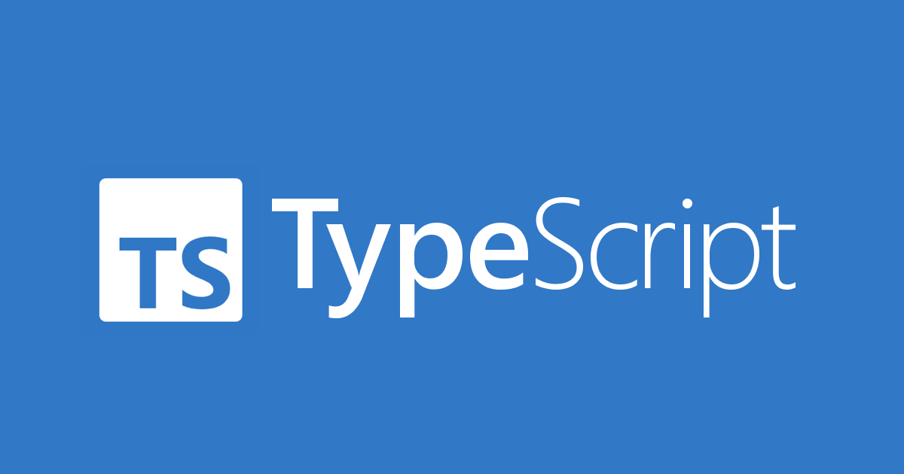
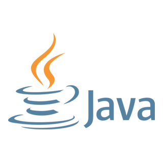

## Learning TypeScript for the first time

When I first started learning TypeScript, the biggest hurdle I faced was that I hadn’t coded in over half a year. It felt like a long time, and I was anxious about whether I could still code. Luckily, I was able to brush up on my skills while learning basic JavaScript and ES6 through FreeCodeCamp. While learning both JavaScript and TypeScript, I noticed that they were quite similar to Java, a language I’m much more familiar with.

However, there were still concepts I hadn’t encountered before, such as promises, type aliases, and generics. These new ideas were difficult to understand and confusing at first. That said, in terms of ease of development, I believe TypeScript is a more flexible programming language compared to C, especially when it comes to handling complex data structures.

## Similarities and Differences between TypeScript and Java



Both TypeScript and Java are object-oriented programming languages. I found a lot of similarities between TypeScript and Java, which were mostly basic things like operators, for loops, and if-else statements.

Both languages use similar syntax for common logical and mathematical operators, and both use similar syntax for conditional statements and loops.

One difference I noticed is how data types for numbers are initialized. In TypeScript, the data type for numbers is simply called 'number', whereas in Java, you have specific types like 'int', 'short', 'long', 'float', etc.

Another difference is how the return type of a function is stated. In TypeScript, a function begins with the keyword 'function', and the return type is declared after the function’s parameters followed by a colon. In Java, a method starts with the visibility modifier (like 'public' or 'private'), and the return type is declared before the method’s parameters.

Below is a short code for a function called findSum in TypeScript:
```
function findSum(num: number): string {
  let sum: number = 0;
  for (let i = 1; i <= num; i++) {
    sum += i; // Add numbers from 1 to num
  }

  if (sum > 10) {
    return 'Sum is greater than 10';
  } else {
    return 'Sum is 10 or less';
  }
}
```

Below is the expected code in Java:
```
public static String findSum(int num) {
  int sum = 0;
  for (int i = 1; i <= num; i++) {
  sum += i; // Add numbers from 1 to num
  }

  if (sum > 10) {
    return "Sum is greater than 10";
  } else {
    return "Sum is 10 or less";
  }
}
```

## About the notorious WODs

In my Software Engineering I course at the University of Hawaiʻi at Mānoa, there is a timed programming assessment called "Workout of the Day" (WOD) every week during class. I find the WODs stressful due to the time limit and dread not finishing the program on time.

I find the practice WODs enjoyable and useful, but for the purpose of best preparing students for the graded in-class WOD, I think they should be made more difficult. Nonetheless, I utilize the resources available to me, including the practice WODs and previous assignments to ensure that I am as prepared as possible.

*As Bruce Lee and Vince Lombardi once said, "Practice makes perfect."*

I believe and hope that the WODs will improve my efficiency in software engineering skills.
