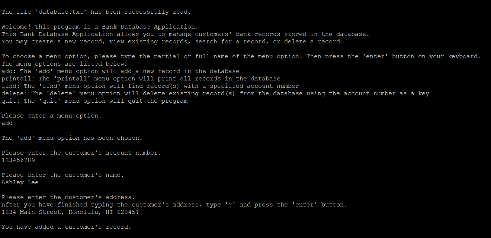
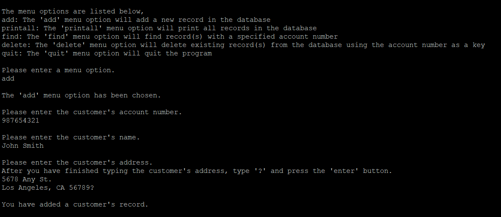
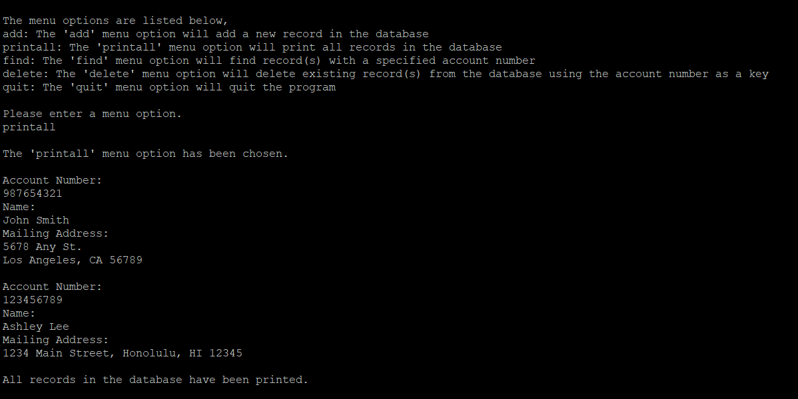
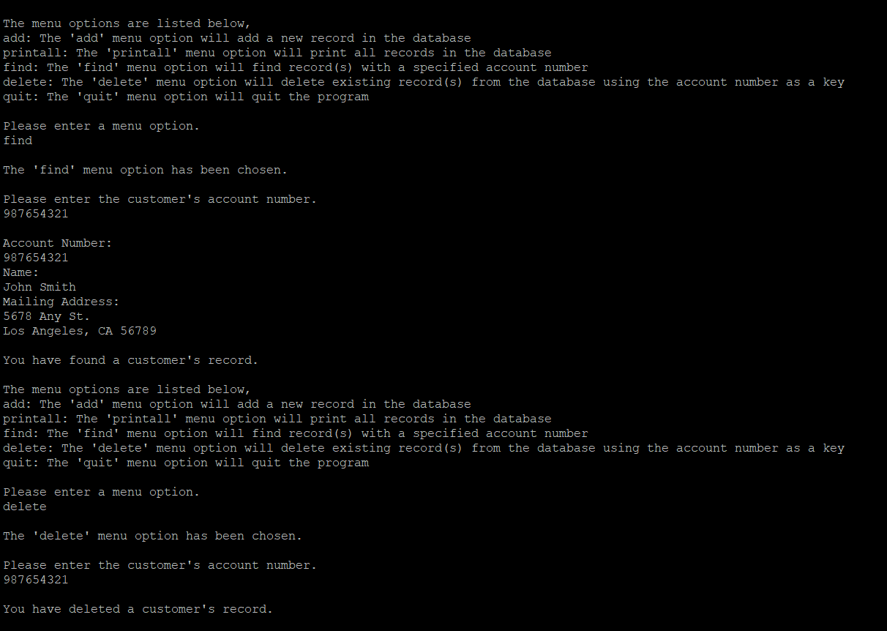
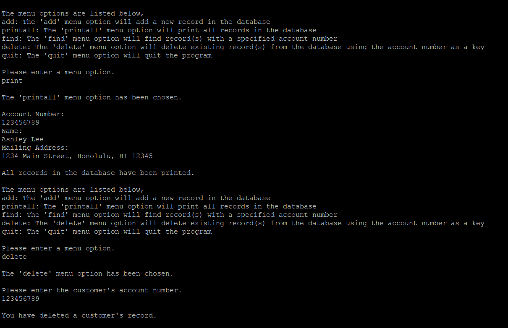
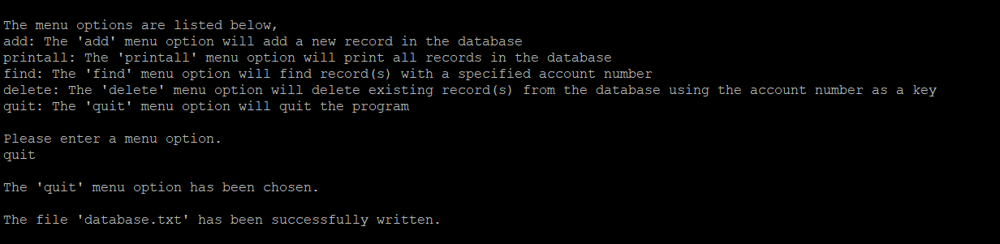

  
  
  
  
  
  

This Bank Database Application is a solo project I completed in my Program Structure course (ICS 212) at the University of Hawaiʻi at Mānoa. I designed and implemented a user-friendly interface and database functions, allowing users to add, search, delete, and view customer records. I developed the application in both C and C++ using the UNIX operating system.

To efficiently manage the build process, I created a Makefile to handle the creation and updating of object files and the executable, including the option to run the program with or without debug mode through specified rules. I initially programmed the project in C and then ported it to C++. For the C project, I created header files containing the data structure for records and the function prototypes for the database functions. For the C++ project, I created header files containing the data structure for records and the class definition for managing records. The source files are separately organized for the user interface and database functions.

Here is the code for the add function of the Bank Database Application in C:

```cpp
int addRecord(struct record ** startAddress, int uaccountno, char uname[], char uaddress[])
{
    int stop;
    int result;
    struct record * new;
    struct record * addressOfPrevious;
    struct record * addressOfNext;

    stop = 0;
    result = -1;

    if (debugmode == 1)
    {
        printf("\nDebug Message:\n");
        printf("The addRecord function has been called.\n");
        printf("The function parameter names and values are listed below,\n");
        printf("uaccountno: \n%d\n", uaccountno);
        printf("uname: \n%s\n", uname);
        printf("uaddress: \n%s\n", uaddress);
    }

    if (*startAddress == NULL)
    {
        *startAddress = (struct record *)malloc(sizeof(struct record));
        (*startAddress) -> accountno = uaccountno;
        strcpy((*startAddress) -> name, uname);
        strcpy((*startAddress) -> address, uaddress);
        (*startAddress) -> next = NULL;

        result = 0;
    }
    else if (uaccountno == (*startAddress) -> accountno)
    {
        result = -1;
    }
    else if (uaccountno > (*startAddress) -> accountno)
    {
        new = (struct record *)malloc(sizeof(struct record));
        new -> accountno = uaccountno;
        strcpy(new -> name, uname);
        strcpy(new -> address, uaddress);
        new -> next = *startAddress;
        *startAddress = new;

        result = 0;
    }
    else
    {
        if ((*startAddress) -> next != NULL)
        {
            addressOfPrevious = *startAddress;
            addressOfNext = (*startAddress) -> next;
            while (stop == 0)
            {
                if (uaccountno == addressOfNext -> accountno)
                {
                    stop = 1;
                    result = -1;
                }
                else if (uaccountno < addressOfNext -> accountno)
                {
                    if (addressOfNext -> next == NULL)
                    {
                        new = (struct record *)malloc(sizeof(struct record));
                        new -> accountno = uaccountno;
                        strcpy(new -> name, uname);
                        strcpy(new -> address, uaddress);
                        new -> next = NULL;
                        addressOfNext -> next = new;

                        stop = 1;
                        result = 0;
                    }
                    else
                    {
                        addressOfPrevious = addressOfNext;
                        addressOfNext = addressOfNext -> next;
                    }
                }
                else
                {
                    new = (struct record *)malloc(sizeof(struct record));
                    new -> accountno = uaccountno;
                    strcpy(new -> name, uname);
                    strcpy(new -> address, uaddress);
                    new -> next = addressOfNext;
                    addressOfPrevious -> next = new;

                    stop = 1;
                    result = 0;
                }
            }
        }
        else
        {
            new = (struct record *)malloc(sizeof(struct record));
            new -> accountno = uaccountno;
            strcpy(new -> name, uname);
            strcpy(new -> address, uaddress);
            new -> next = NULL;
            (*startAddress) -> next = new;

            result = 0;
        }
    }

    return result;
}
```

To see the code for my Bank Database Application in C, click here. To see the code for my Bank Database Application in C++, click here.
