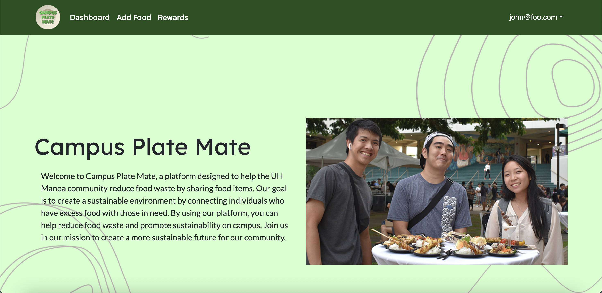

## Project Overview

Campus Plate Mate is a web application designed to allow users to offer or exchange leftover or unused foods within the UH Manoa area. This platform allows users to offer or claim food items, with the added incentive of earning rewards for participation. The project showcases the utilization of various technologies learned throughout our software engineering course including Next.js - a powerful framework built on React that enables server-side rendering and site generation, React - a JavaScript library for building user interfaces with reusable components, and React Bootstrap - a CSS framework used for efficient and responsive UI design.

As a team, our goal was to create a functional and user-friendly platform where individuals can offer or claim food, earn rewards for participating, and help reduce food waste while promoting community engagement. Throughout this project, we applied the skills we learned in our software engineering course, ICS 314, including creating and managing databases, implementing interactive pages for user engagement, and utilizing UI/UX design principles and CSS tools to build a clean, modern website layout.

## My Contributions

I worked on creating the landing page after login. I designed and implemented the landing page that users see after they log in, ensuring an intuitive user experience. I created the GitHub workflow status badge for the project, allowing us to easily track the status of our builds and deployments in real-time. I implemented a filter on the dashboard page that sorts food items based on quantity, allowing users to sort the listings from least to most quantity and vice versa. I developed a filter for the rewards page that sorts reward items by points, giving users the ability to view rewards from least to most points and most to least. I added a real-time search functionality to the dashboard by adding a real-time search bar, allowing users to search for specific food items as they type, making navigation quicker and more efficient.

## What I Learned

I learned teamwork and collaboration. Working with a team to manage GitHub repositories and coordinating efforts on a single project taught me the importance of effective communication and version control in collaborative environments. I learned how to create a GitHub workflow status badge, which helped keep the project organized and transparent for all contributors. I developed an understanding of how to implement dynamic filters to sort and organize data on a website, which improves the user experience by allowing users to find relevant items faster. I learned how to implement a search bar that that searches user-entered data in real-time, which improves website usability and performance.

For those interested in learning more about the project, visit the <a href="https://campusplatemate.github.io">Campus Plate Mate homepage</a> for detailed information and a user guide. To view the source code, visit the <a href="https://github.com/campusplatemate/application">Campus Plate Mate GitHub repository</a>.
