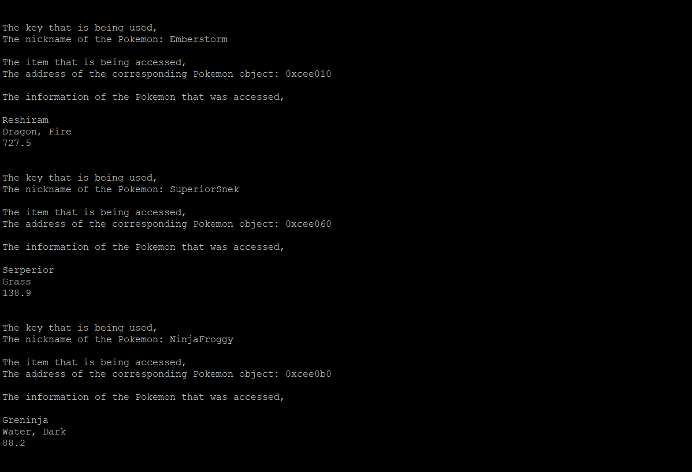

  

This Pokédex program is a solo project I completed in my Program Structure course (ICS 212) at the University of Hawaiʻi at Mānoa. I designed and implemented the Pokédex program that dynamically creates instances of Pokémon objects, stores them in a map with nicknames as keys, allows access to their data through a vector, and ensures proper memory cleanup after displaying the Pokémon's information. I developed the program in C++ on the UNIX operating system and created a Makefile to handle the creation and updating of object files and the executable, optimizing the build process.

This program creates instances of all the child classes in heap memory and stores their addresses in Pokemon* pointers. It creates a vector to store three nicknames and a map to associate each nickname with its corresponding Pokemon pointer. Using each element from the vector, the program accesses the corresponding item in the map and prints the key being used, the item being accessed, and the Pokémon's information. It then calls the checkPokedex function with the pointer, which displays all three Pokémon in the terminal. Finally, the program cleans up heap memory by calling the destructors of the child classes to delete the objects.

Through this project, I learned how to create an abstract parent class, as well as constructors, destructors, and functions for child classes in C++. I gained experience in creating instances of child classes in heap memory and performing memory cleanup in C++. I also learned how to utilize maps and vectors to access data using keys, and how to integrate all these concepts into a single program.

Here is the code for the main function:

```cpp
int main(int argc, char* argv[])
{
    Pokemon * pokemonReshiram;
    Pokemon * pokemonSerperior;
    Pokemon * pokemonGreninja;

    std::cout << "\nThe Pokemon objects are created," << "\n" << std::endl;

    pokemonReshiram = new Reshiram();
    pokemonSerperior = new Serperior();
    pokemonGreninja = new Greninja();

    std::vector<std::string> nicknames;
    nicknames.push_back("Emberstorm");
    nicknames.push_back("SuperiorSnek");
    nicknames.push_back("NinjaFroggy");

    std::map<std::string, Pokemon*> pokemonPointers;
    pokemonPointers["Emberstorm"] = pokemonReshiram;
    pokemonPointers["SuperiorSnek"] = pokemonSerperior;
    pokemonPointers["NinjaFroggy"] = pokemonGreninja;

    std::cout << std::endl;

    for (std::vector<std::string>::iterator key = nicknames.begin(); key != nicknames.end(); ++key)
    {
        std::cout << "\nThe key that is being used,";
        std::cout << "\nThe nickname of the Pokemon: " << *key << std::endl;
        std::cout << "\nThe item that is being accessed,";
        std::cout << "\nThe address of the corresponding Pokemon object: ";
        std::cout << pokemonPointers[*key] << std::endl;
        std::cout << "\nThe information of the Pokemon that was accessed," << "\n" << std::endl;
        checkPokedex(pokemonPointers[*key]);
        std::cout << std::endl;
    }

    std::cout << "\nThe Pokemon objects are deleted," << "\n" << std::endl;

    delete pokemonReshiram;
    delete pokemonSerperior;
    delete pokemonGreninja;

    return 0;
}
```

To see the code for my Pokédex program, click <a href="https://github.com/jaylin-m/ICS-212/blob/main/homework9.tar.gz">here</a>.
