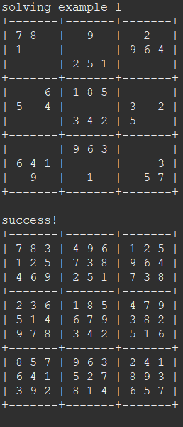
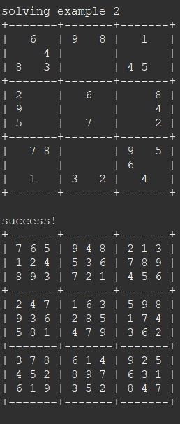
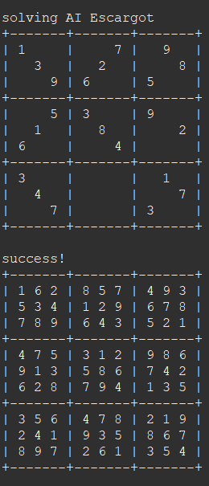

  
  
  

This Sudoku solver application is a solo project I completed in my Introduction to Computer Science II course (ICS 211) at the University of Hawaiʻi at Mānoa. The goal for each method was outlined, and I worked on implementing the code for each method on my own. I developed the application in Java on the Eclipse IDE. The application checks if the puzzle obeys all Sudoku rules and validates the puzzle's correctness. It systematically fills in blank cells and ensure compliance with Sudoku constraints. I also created a user-friendly output format for displaying the Sudoku puzzles and solutions to enhance readability.

Through this project, I learned how to problem-solve when implementing recursive algorithms and nested for loops to work with multidimensional arrays. I learned how to implement the toString method in Java to display the Sudoku grid in a readable format. I also learned how to test the application's solver functionality using different test Sudoku boards and automate the testing process using the SudokuTest class, which checks if the program's solution matches a given expected solution.

Here is the code for the checkSudoku method, which checks if the Sudoku rules hold in the puzzle:

```cpp
public static boolean checkSudoku (int [] [] sudoku, boolean printErrors)
  {
    if (sudoku.length != 9) {
      if (printErrors) {
        System.out.println ("sudoku has " + sudoku.length +
                            " rows, should have 9");
      }
      return false;
    }
    for (int i = 0; i < sudoku.length; i++) {
      if (sudoku [i].length != 9) {
        if (printErrors) {
          System.out.println ("sudoku row " + i + " has " +
                              sudoku [i].length + " cells, should have 9");
        }
        return false;
      }
    }
    /* check each cell for conflicts */
    for (int i = 0; i < sudoku.length; i++) {
      for (int j = 0; j < sudoku.length; j++) {
        int cell = sudoku [i] [j];
        if (cell == 0) {
          continue;   /* blanks are always OK */
        }
        if ((cell < 1) || (cell > 9)) {
          if (printErrors) {
            System.out.println ("sudoku row " + i + " column " + j +
                                " has illegal value " + cell);
          }
          return false;
        }
        /* does it match any other value in the same row? */
        for (int m = 0; m < sudoku.length; m++) {
          if ((j != m) && (cell == sudoku [i] [m])) {
            if (printErrors) {
              System.out.println ("sudoku row " + i + " has " + cell +
                                  " at both positions " + j + " and " + m);
            }
            return false;
          }
        }
        /* does it match any other value it in the same column? */
        for (int k = 0; k < sudoku.length; k++) {
          if ((i != k) && (cell == sudoku [k] [j])) {
            if (printErrors) {
              System.out.println ("sudoku column " + j + " has " + cell +
                                  " at both positions " + i + " and " + k);
            }
            return false;
          }
        }
        /* does it match any other value in the 3x3? */
        for (int k = 0; k < 3; k++) {
          for (int m = 0; m < 3; m++) {
            int testRow = (i / 3 * 3) + k;   /* test this row */
            int testCol = (j / 3 * 3) + m;   /* test this col */
            if ((i != testRow) && (j != testCol) &&
                (cell == sudoku [testRow] [testCol])) {
              if (printErrors) {
                System.out.println ("sudoku character " + cell + " at row " +
                                    i + ", column " + j + 
                                    " matches character at row " + testRow +
                                    ", column " + testCol);
              }
              return false;
            }
          }
        }
      }
    }
    return true;
  }
```

Here is the code for the fillSudoku method, which finds an assignment of values to the Sudoku cells that makes the puzzle valid:

```cpp
public static boolean fillSudoku (int [] [] sudoku)
  {
    boolean allFilled = true;
    int row = -1;
    int col = -1;
    for (int i = 0; i < 9; i++) {
    	for (int j = 0; j < 9; j++) {
    		if (sudoku[i][j] == 0) {
    			row = i;
    			col = j;
    			allFilled = false;
    			break;
    		}
    	}
    	if (!allFilled) {
			break;
		}
    }
    
    if (allFilled == true) return true;
    
    for (int num = 1; num <= 9; num++) {
    	sudoku[row][col] = num;
    	if (checkSudoku(sudoku, false)) {
    		if (fillSudoku(sudoku)) {
    			return true;
    		}
    	}
    }
    sudoku[row][col] = 0;
    return false;
  }
```

To see the code for the Sudoku application, click <a href="https://github.com/jaylin-m/ICS-211/blob/main/Sudoku.java">here</a>. To see the test code for the Sudoku application, click <a href="https://github.com/jaylin-m/ICS-211/blob/main/SudokuTest.java">here</a>.
